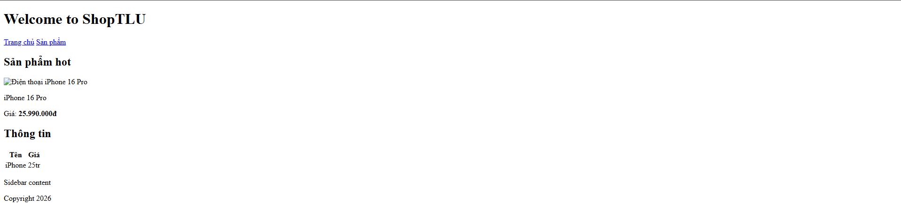
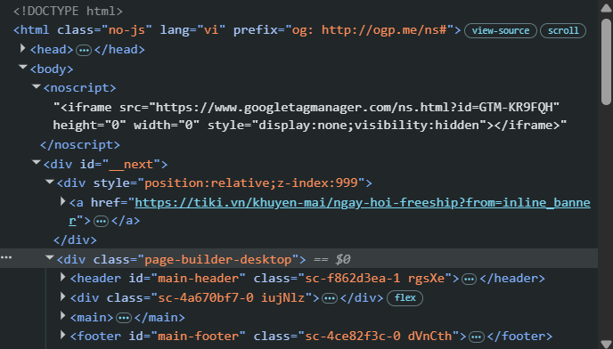
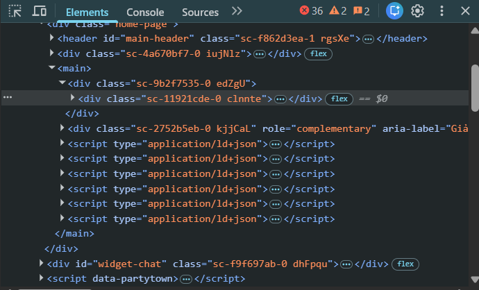
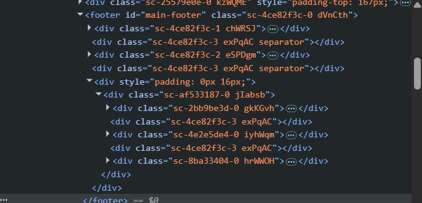

# PHẦN A — KIỂM TRA ĐỌC HIỂU (20 điểm)

## Câu A1 (5đ) — HTTP & Browser

### 1. 5 bước xảy ra khi gõ `https://shopee.vn` vào trình duyệt và nhấn Enter (từ DNS lookup đến render):

> *Nguồn tham chiếu: File `01_introduction_html_universe.md` — Mục "🎬 Cuộc Hành Trình 0.3 Giây Xuyên Đại Dương", Mục "1.1. Kiến trúc Client-Server" và Mục "1.3. Browser Rendering — Từ Code thành Hình ảnh".*

Dưới đây là đúng thứ tự các bước diễn ra:

1. **DNS Lookup (Phân giải tên miền):** Trình duyệt tiến hành dịch tên miền `shopee.vn` thành địa chỉ IP thực của máy chủ để biết cần gửi yêu cầu đi đâu.
2. **Gửi HTTP Request (Hành trình của Client):** Trình duyệt đóng vai trò là **Client** gửi một yêu cầu (HTTP Request - ví dụ phương thức GET) đi qua router WiFi, qua nhà mạng ISP, xuyên qua hệ thống cáp quang để đến máy chủ (Server). 
3. **Xử lý tại Server và phản hồi (HTTP Response):** Máy chủ nhận yêu cầu, xử lý dữ liệu và gửi phản hồi (HTTP Response) chứa các file tài nguyên (HTML, CSS, JS) chạy ngược qua hệ thống cáp quang để về lại thiết bị của người dùng.
4. **Phân tích mã nguồn (Parse HTML & CSS):** Ngay khi nhận được file, trình duyệt Chrome sẽ bắt đầu đọc bản vẽ kiến trúc cấu trúc trang (**Parse HTML**) và đọc bản thiết kế nội thất về màu sắc, layout (**Parse CSS**).
5. **Thực thi và hiển thị hoàn thiện (Execute JS & Paint/Render):** Trình duyệt tiến hành lắp đặt hệ thống tương tác và logic (**Execute JS**), sau đó vẽ giao diện hoàn chỉnh lên màn hình (**Paint & Render**) để hiển thị trang Shopee cho người dùng.

---------------

### 2. Tab Network trong Chrome DevTools và phân tích thực tế:

> *Nguồn tham chiếu: File `01_introduction_html_universe.md` — Mục "4.3. Developer Tools (F12) — "Kính hiển vi" cho website".*

**Tab Network cho thấy thông tin gì?**
Trong Chrome DevTools, tab **Network** đóng vai trò như một bản ghi chi tiết toàn bộ luồng giao tiếp mạng (gửi requests và nhận responses) giữa trình duyệt (Client) và máy chủ (Server). Cụ thể, công cụ này giúp Web Developer:
- **Theo dõi tài nguyên:** Liệt kê tất cả các file được tải về để tạo nên trang web (HTML, CSS, JavaScript, Hình ảnh...).
- **Phân tích hiệu suất:** Cho biết dung lượng và thời gian tải của từng file, giúp giải quyết bài toán tối ưu hóa ("Website tải chậm — file nào nặng nhất?").
- **Kiểm tra trạng thái (Status):** Xác nhận các request gửi đi có thành công hay không thông qua các HTTP Response Codes (ví dụ: `200 OK`, `404 Not Found`).

**Ảnh chụp màn hình phân tích tab Network(E lấy ví dụ trang web của mancity.com):**


## Câu A2 (5đ) — Semantic HTML

**1. Tại sao trang web trên bị Google đánh giá SEO thấp?**
Trang web này mắc lỗi lạm dụng thẻ `<div>` (thường được giới lập trình gọi là lỗi "div soup"). Thẻ `<div>` là một thẻ vô nghĩa (non-semantic). Khi các công cụ tìm kiếm (như Google Bot) hoặc trình đọc màn hình quét qua, chúng chỉ thấy các khối hộp vô danh mà không thể phân biệt được đâu là phần đầu trang, đâu là menu điều hướng, nội dung chính hay tiêu đề bài viết. Vì không thể hiểu được cấu trúc và ngữ cảnh của nội dung, Google sẽ đánh giá điểm SEO của trang này rất thấp.

**2. Liệt kê 4 lỗi semantic và cách khắc phục:**
1. **Lỗi phần đầu trang:** Dùng `<div class="header">` thay vì thẻ chuẩn `<header>`.
2. **Lỗi thanh điều hướng:** Dùng `<div class="menu">` cho menu. Đáng lẽ phải dùng thẻ `<nav>` kết hợp với danh sách `<ul>`, `<li>` để nhóm các liên kết lại với nhau.
3. **Lỗi khối nội dung chính:** Dùng `<div class="main">` thay vì thẻ `<main>`. Công cụ tìm kiếm cần thẻ `<main>` để biết trọng tâm của trang nằm ở đâu.
4. **Lỗi tiêu đề bài viết:** Dùng `<div class="title">` thay vì các thẻ Heading (như `<h1>` hoặc `<h2>`). Google rất chú trọng vào các thẻ Heading để trích xuất từ khóa chính của trang.
*(Bổ sung thêm: Thẻ `` đang bị thiếu thuộc tính `alt` để mô tả nội dung ảnh cho Google hiểu).*

**3. Mã HTML sau khi đã sửa lại cho chuẩn Semantic:**

```html
<header>
  <div class="logo">ShopTLU</div>
  <nav class="menu">
    <ul>
      <li><a href="/">Trang chủ</a></li>
      <li><a href="/products">Sản phẩm</a></li>
    </ul>
  </nav>
</header>

<main>
  <article class="product">
    <h1 class="title">iPhone 16 Pro</h1>
    <p class="price">25.990.000đ</p>
    <div class="image">
      
    </div>
  </article>
</main>

<footer>
  <p>© 2026 ShopTLU</p>
</footer>
```

## Câu A3 (5đ) — Block vs Inline

**1. Mô phỏng kết quả hiển thị (Text Art):**

Kết quả hiển thị trên trình duyệt sẽ có dạng như sau:

+--------------------------------------------------+
| Hộp 1                                            |
+--------------------------------------------------+
| Text A Text B                                    |
+--------------------------------------------------+
| Hộp 2                                            |
+--------------------------------------------------+
| Text C **Text D** |
+--------------------------------------------------+
| Hộp 3                                            |
+--------------------------------------------------+
*(Lưu ý: Chữ "Text D" sẽ được in đậm do nằm trong thẻ <strong>)*

**2. Giải thích chi tiết tại sao lại hiển thị như vậy:**

Nguyên lý hiển thị của HTML dựa vào đặc tính mặc định của các thẻ (Block hoặc Inline):

* **Thẻ Block (như `<div>`):** Luôn luôn bắt đầu trên một dòng mới và chiếm toàn bộ chiều rộng có thể của phần tử chứa nó (dù nội dung bên trong rất ngắn).
* **Thẻ Inline (như `<span>`, `<strong>`):** Không bắt đầu trên dòng mới, chúng chỉ chiếm khoảng không gian vừa đủ chứa nội dung bên trong và sẽ nằm cạnh nhau trên cùng một dòng (trừ khi hết chỗ mới bị rớt dòng).

**Phân tích từng dòng code:**
1.  `<div>Hộp 1</div>`: Là thẻ Block, nên "Hộp 1" đứng riêng một dòng và chiếm hết chiều ngang.
2.  `<span>Text A</span>` và `<span>Text B</span>`: Đều là thẻ Inline. Chúng sẽ nằm ngay cạnh nhau trên cùng một dòng tiếp theo tạo thành `Text A Text B`.
3.  `<div>Hộp 2</div>`: Là thẻ Block. Dù dòng chứa Text A & B vẫn còn chỗ, `<div>` này vẫn ép nó xuống một dòng mới, chiếm trọn 1 dòng.
4.  `<span>Text C</span>` và `<strong>Text D</strong>`: Đều là thẻ Inline. Tương tự như trên, chúng đứng cạnh nhau trên dòng mới tạo thành `Text C Text D` (trong đó Text D bị làm đậm bởi thẻ `<strong>`).
5.  `<div>Hộp 3</div>`: Là thẻ Block, tiếp tục bị đẩy xuống một dòng mới đứng một mình.


## Câu A4 (5đ) — Table

> *Nguồn tham chiếu: File `05_tables_hyperlinks.md` — Mục "📊 Table — Bảng dữ liệu"*

**1. Sự khác nhau giữa `<thead>`, `<tbody>`, `<tfoot>`:**

Ba thẻ này được sử dụng để phân chia cấu trúc ngữ nghĩa (semantic) của một bảng dữ liệu (`<table>`), giúp trình duyệt và công cụ tìm kiếm hiểu rõ các thành phần của bảng:
* **`<thead>` (Table Head):** Nhóm các hàng chứa tiêu đề cột của bảng. Thường chứa các thẻ `<th>` (Table Header Cell) để in đậm tiêu đề.
* **`<tbody>` (Table Body):** Chứa phần thân của bảng, là nơi đặt các hàng dữ liệu chính chi tiết (thẻ `<td>`). Một bảng có thể có nhiều thẻ `<tbody>`.
* **`<tfoot>` (Table Foot):** Chứa phần chân bảng, thường dùng cho các hàng tổng kết, tính tổng, hoặc ghi chú dữ liệu (ví dụ: "Tổng sản phẩm", "Tổng tiền").

**2. Tại sao KHÔNG NÊN dùng table để tạo layout trang web?**

Trong quá khứ, Web Developer thường dùng `<table>` để chia bố cục trang (layout) vì nó dễ định hình. Tuy nhiên, hiện tại đây là một phương pháp **sai lầm** vì 3 lý do chính sau:

1. **Sai mục đích ngữ nghĩa (Semantic):** Thẻ `<table>` sinh ra chỉ để chứa **dữ liệu dạng bảng** (data tabular) như danh sách, so sánh, thống kê. Việc ép nó làm layout sẽ khiến các công cụ tìm kiếm (như Google Bot) và trình đọc màn hình hiểu sai cấu trúc trang, làm giảm nghiêm trọng điểm SEO.
2. **Khó bảo trì và code phức tạp (Code Bloat):** Layout bằng bảng đòi hỏi phải lồng ghép rất nhiều thẻ `<tr>`, `<td>` phức tạp. Khi muốn thay đổi một chi tiết nhỏ trong giao diện, bạn có thể phá vỡ toàn bộ cấu trúc các hàng/cột liên quan, khiến code rối rắm và rất khó bảo trì.
3. **Không hỗ trợ tốt Responsive Design:** Các bảng (`table`) có tính chất cứng nhắc và rất khó để co giãn, xếp chồng giao diện mượt mà trên các thiết bị màn hình nhỏ như điện thoại di động. Thay vào đó, lập trình viên hiện đại phải sử dụng **CSS Flexbox** hoặc **CSS Grid** để tạo layout linh hoạt.


## Câu B3 (15đ) — Debug HTML

Danh sách các lỗi đã được tìm thấy và khắc phục trong file `debug.html`:

* **Lỗi 1: Dòng 1 — Thiếu định dạng chuẩn của HTML5** — Sửa `<!DOCTYPE>` thành `<!DOCTYPE html>`.
* **Lỗi 2: Dòng 1 & 2 — Thiếu thẻ `<html>` chuẩn và quên đóng thẻ `<title>`** — Bổ sung thuộc tính ngôn ngữ `<html lang="vi">` và thêm thẻ đóng `</title>`.
* **Lỗi 3: Dòng 3 — Sai giá trị bảng mã ký tự** — Sửa `<meta charset="utf8">` thành `<meta charset="UTF-8">`.
* **Lỗi 4: Dòng 4 — Sai cú pháp thẻ đóng `<h1>`** — Thẻ đóng bị thiếu dấu gạch chéo, sửa `<h1>...<h1>` thành `<h1>...</h1>`.
* **Lỗi 5: Dòng 4 & 6 — Lỗi ngữ nghĩa (Semantic) phần Header** — Thẻ `<h1>` đang nằm phơi bày bên ngoài, cần được đưa vào bên trong thẻ `<header>` để nhóm cấu trúc hợp lý.
* **Lỗi 6: Dòng 8 — Sai cú pháp thẻ đóng `<a>`** — Thẻ đóng của link "Trang chủ" bị thiếu dấu gạch chéo, sửa `<a>...<a>` thành `<a>...</a>`.
* **Lỗi 7: Dòng 15 & 22 — Lỗi nhảy cóc cấp độ tiêu đề (Heading)** — Đang dùng `<h3>` ngay sau `<h1>` (bỏ qua `<h2>`). Cần đổi `<h3>` thành `<h2>` cho đúng cấu trúc.
* **Lỗi 8: Dòng 16 — Thiếu ngoặc kép và thiếu thuộc tính `alt` của ảnh** — Sửa `` thành ``.
* **Lỗi 9: Dòng 18 — Lỗi lồng chéo thẻ (Overlapping tags)** — Mở `<b>` trước nhưng lại đóng `</p>` trước. Sửa lại thứ tự thành `<p>...<strong>...</strong></p>` (đồng thời đổi `<b>` thành `<strong>` cho chuẩn Semantic).
* **Lỗi 10: Dòng 24 đến 27 — Lỗi ngữ nghĩa bảng (Table Header)** — Các ô tiêu đề của bảng đang dùng thẻ dữ liệu `<td>`, cần sửa thành thẻ tiêu đề `<th>`.
* **Lỗi 11: Dòng 36 đến 38 — Lỗi lạm dụng `<main>` và sai cấu trúc Sidebar** — Một trang web chỉ được có 1 thẻ `<main>`. Phần chứa "Sidebar content" phải được đổi thành thẻ `<aside>`.
* **Lỗi 12: Dòng 41 — Quên đóng thẻ đoạn văn** — Sửa `<p>Copyright 2026` thành `<p>Copyright 2026</p>`.

**Ảnh chụp kết quả hiển thị của trang web sau khi Debug:**




## Câu B4 (15đ) — Phân tích trang web thật

**Trang web được chọn:** `tiki.vn`

**1. Phân tích thẻ Semantic (Tab Elements):**
* **3 thẻ Semantic HTML5 được sử dụng đúng:**
    * `<header>`: Bao bọc toàn bộ phần đầu trang (chứa logo, thanh tìm kiếm, giỏ hàng, menu tài khoản).
    * `<main>`: Bọc phần thân chính chứa các danh sách sản phẩm và banner khuyến mãi.
    * `<footer>`: Nằm ở cuối trang, chứa các liên kết hỗ trợ khách hàng, thông tin công ty và chứng nhận.
* **2 thẻ sử dụng KHÔNG ĐÚNG ngữ nghĩa (Lạm dụng thẻ div):**
    * Rất nhiều đoạn văn bản ngắn (như tên sản phẩm, giá tiền) đang bị lạm dụng bọc trong thẻ `<div class="...">` hoặc `<span>` thay vì dùng các thẻ chuẩn như `<p>`, `<h3>`, hoặc `<strong>`.
    * Một số nút bấm để mở menu dropdown được code bằng thẻ `<div>` gắn sự kiện click bằng JavaScript thay vì dùng thẻ `<button>` chuẩn.


